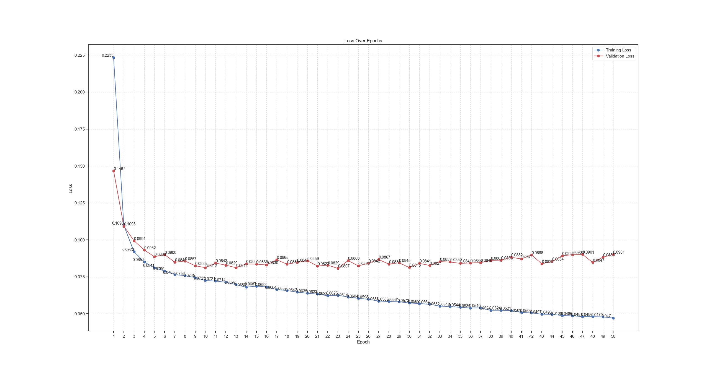
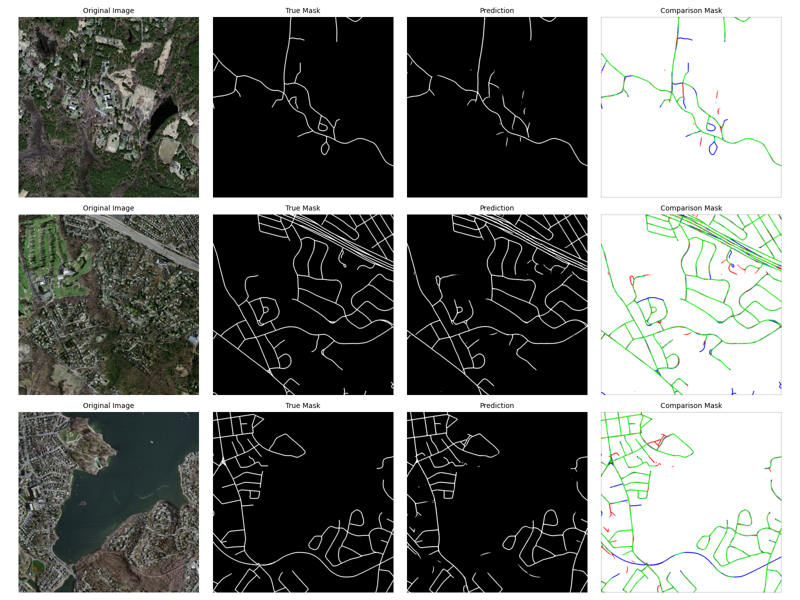

## 📊 Training Metrics

| Epoch | Train Loss | Val Loss | Val IoU | Time (sec) |
|-------|------------|----------|---------|------------|
| 01    | 0.2233     | 0.1467   | 0.4651  | 565.52     |
| 02    | 0.1098     | 0.1093   | 0.5485  | 536.75     |
| 03    | 0.0920     | 0.0994   | 0.5321  | 519.37     |
| 04    | 0.0851     | 0.0932   | 0.5507  | 517.37     |
| 05    | 0.0811     | 0.0886   | 0.5793  | 520.48     |
| 06    | 0.0790     | 0.0900   | 0.5707  | 523.05     |
| 07    | 0.0765     | 0.0849   | 0.5968  | 522.67     |
| 08    | 0.0758     | 0.0857   | 0.5996  | 525.23     |
| 09    | 0.0745     | 0.0825   | 0.6132  | 530.41     |
| 10    | 0.0725     | 0.0812   | 0.6047  | 520.63     |
| 11    | 0.0721     | 0.0843   | 0.5883  | 522.72     |
| 12    | 0.0714     | 0.0829   | 0.5900  | 521.32     |
| 13    | 0.0697     | 0.0812   | 0.6076  | 517.79     |
| 14    | 0.0680     | 0.0837   | 0.5988  | 519.27     |
| 15    | 0.0687     | 0.0836   | 0.5999  | 522.51     |
| 16    | 0.0682     | 0.0830   | 0.6023  | 539.98     |
| 17    | 0.0664     | 0.0865   | 0.5735  | 521.79     |
| 18    | 0.0657     | 0.0836   | 0.6007  | 520.96     |
| 19    | 0.0647     | 0.0847   | 0.5973  | 520.70     |
| 20    | 0.0639     | 0.0859   | 0.5939  | 520.80     |
| 21    | 0.0633     | 0.0823   | 0.6044  | 520.42     |
| 22    | 0.0622     | 0.0829   | 0.6102  | 517.56     |
| 23    | 0.0625     | 0.0807   | 0.6102  | 520.50     |
| 24    | 0.0614     | 0.0860   | 0.5822  | 519.63     |
| 25    | 0.0604     | 0.0824   | 0.6168  | 518.01     |
| 26    | 0.0598     | 0.0842   | 0.5954  | 520.45     |
| 27    | 0.0586     | 0.0867   | 0.6010  | 521.59     |
| 28    | 0.0583     | 0.0836   | 0.6001  | 524.45     |
| 29    | 0.0581     | 0.0845   | 0.6057  | 525.50     |
| 30    | 0.0573     | 0.0813   | 0.6175  | 521.04     |
| 31    | 0.0569     | 0.0841   | 0.6208  | 520.44     |
| 32    | 0.0564     | 0.0827   | 0.6188  | 520.84     |
| 33    | 0.0552     | 0.0853   | 0.5975  | 519.09     |
| 34    | 0.0548     | 0.0850   | 0.6074  | 519.77     |
| 35    | 0.0544     | 0.0841   | 0.6121  | 520.11     |
| 36    | 0.0539     | 0.0844   | 0.6115  | 519.47     |
| 37    | 0.0540     | 0.0846   | 0.6202  | 521.13     |
| 38    | 0.0524     | 0.0861   | 0.6092  | 517.84     |
| 39    | 0.0524     | 0.0863   | 0.6052  | 517.38     |
| 40    | 0.0521     | 0.0882   | 0.6174  | 516.69     |
| 41    | 0.0509     | 0.0871   | 0.6051  | 520.22     |
| 42    | 0.0506     | 0.0898   | 0.6120  | 524.66     |
| 43    | 0.0497     | 0.0838   | 0.6194  | 526.60     |
| 44    | 0.0496     | 0.0854   | 0.6081  | 526.51     |
| 45    | 0.0488     | 0.0892   | 0.5958  | 525.83     |
| 46    | 0.0486     | 0.0900   | 0.6144  | 526.32     |
| 47    | 0.0481     | 0.0901   | 0.5980  | 525.56     |
| 48    | 0.0480     | 0.0847   | 0.6252  | 526.16     |
| 49    | 0.0479     | 0.0883   | 0.6104  | 526.19     |
| 50    | 0.0471     | 0.0901   | 0.6128  | 524.57     |

Training and validation loss curves:

## ✅ Test Results

- **IoU:** 0.61299  
- **Dice Coefficient:** 0.75699  
- **Pixel Accuracy:** 0.97639  
- **Precision:** 0.78767  
- **Recall:** 0.73335  

Example predictions on the test set:

